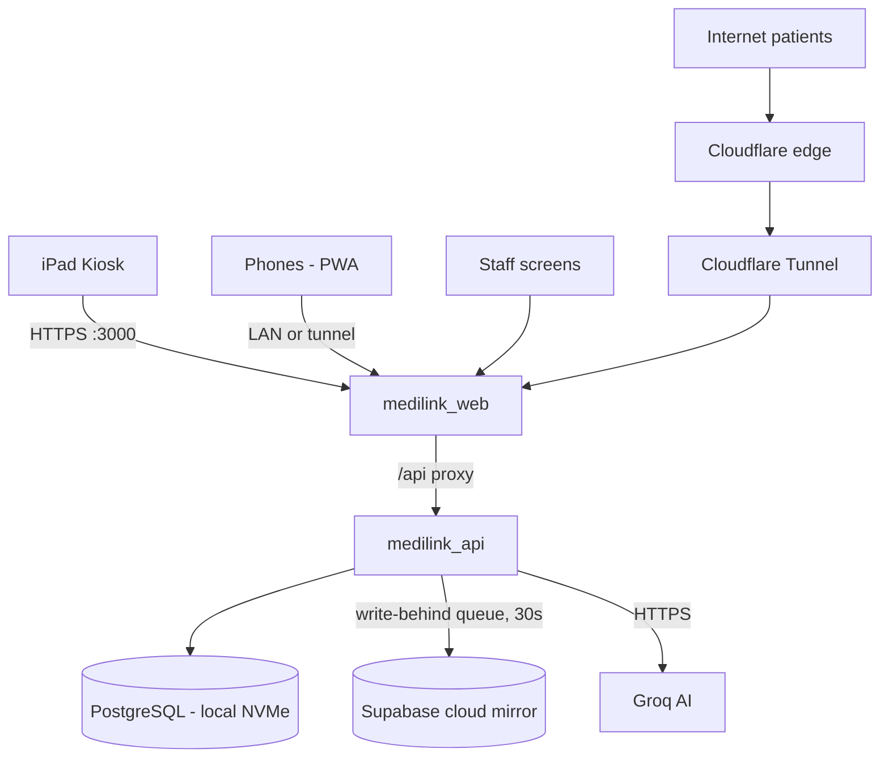

# MediLink — System Architecture

**Local-first, cloud-mirrored Electronic Health Records platform**
Final Year Project — Universiti Teknikal Malaysia Melaka (UTeM) · Yashpreet Singh Gill

## Design thesis

Clinics cannot stop working when the internet does. MediLink therefore treats the
clinic's own server as the source of truth and the cloud as a mirror — the inverse
of most SaaS healthcare systems. Every write completes locally first (write-behind
replication); the patient never waits on a WAN round-trip.

## Components

| Component | Technology | Role |
|---|---|---|
| `medilink_web` | React 19, CRA + craco, TLS dev server | Serves all UIs: kiosk, patient PWA, doctor, pharmacy, reception, admin. Proxies `/api` + WebSockets to the backend (same-origin — no CORS/mixed-content in production paths) |
| `medilink_api` | FastAPI (Python 3.11), uvicorn ×2 workers | Auth, RBAC, business logic, AI gateway, sync engine, file store |
| `medilink_db` | PostgreSQL 16 | Source of truth, lives on local NVMe |
| `medilink_tunnel` | cloudflared | Outbound-only tunnel exposing the patient experience at `medilink.harnova.my` with edge TLS |
| Cloud mirror | Supabase PostgreSQL (`medilink-cloud`) | Cross-clinic record sharing + disaster recovery |
| AI | Groq — Llama 3.3 70B | Triage (MTS), visit summaries, drug-interaction checks |

## Data flow

## The sync engine

Every mutating write also inserts a row into `sync_queue`. A background loop
(every 30 s) drains the queue to the cloud mirror:

- **Retry budget:** 5 attempts with recorded errors; unknown targets are
  dead-lettered (attempts=999) and stay visible in the admin sync view —
  data is never silently dropped.
- **Self-provisioning:** on startup the backend runs `CREATE TABLE IF NOT EXISTS`
  against the mirror, so pointing `.env` at a fresh Supabase project is the whole
  cloud setup.
- **Catch-up:** when connectivity returns after an outage, the queue drains
  automatically. No operator action.

## Dual-mode access

| Surface | LAN (clinic) | Internet (tunnel) |
|---|---|---|
| Kiosk | ✅ | ❌ route redirects, APIs 403 |
| Staff logins | ✅ | ❌ 403 + audit log |
| Registration | ✅ kiosk | ❌ |
| Patient app | ✅ | ✅ (records, bills, receipts, files) |

Public requests are identified server-side by Cloudflare's `CF-Ray` header —
LAN traffic never carries it, and internet traffic cannot avoid it.

## Failure tiers

1. **Internet down, LAN up** — full clinic function. AI triage fails safe to
   Green (arrival-order queue = standard practice); sync queues locally.
2. **LAN down** — devices lose the server; mitigation is a RM150 UPS on the
   router, or the MacBook's own hotspot. Single acknowledged soft spot.
3. **Server loss** — cloud mirror holds all records up to the last sync;
   any machine + `docker compose up` + a restore pull recovers the clinic.

## Scaling path

Load balancing is deferred to Cloudflare's edge. Cloudflare Tunnel natively
supports multiple connectors per tunnel: running the same tunnel on a second
machine gives automatic traffic splitting and failover with zero code change.
